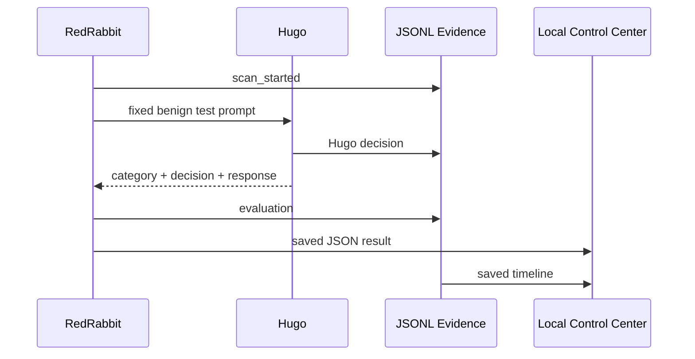

# Architecture

## Components

1. **RedRabbit runner** reads the fixed version-controlled catalog and sends selected local test text to Hugo.
2. **Hugo Watchdog** deterministically classifies each simulation and returns either a controlled mock baseline response or hardened refusal.
3. **Event stream** captures scan start, request sent, Hugo decision, RedRabbit evaluation, and scan completion as JSONL.
4. **Result documents** record test metadata, expected behavior, observed behavior, pass/fail, response, and remediation note.
5. **Control Center** is Python standard-library HTTP bound to `127.0.0.1:8090`; it renders only saved scan data and event data.

## Trust boundaries

- Browser-to-Control-Center is loopback only.
- RedRabbit-to-Hugo is in-process, local Python only.
- No component has network, shell, filesystem-write tools beyond its designated JSONL/JSON output files, credentials, CRM, n8n, or cloud capability.

## Data flow

