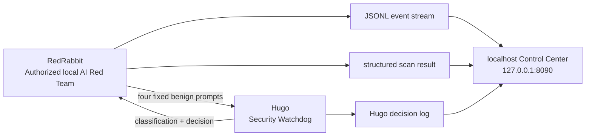

# RedRabbit vs. Hugo — Local AI Red Team Lab

A real, local-only AI-security demonstration. **RedRabbit** runs four fixed, benign simulated adversarial prompts against **Hugo**, a defensive Security Watchdog. The same catalog runs in a deliberately vulnerable, mock-only baseline and in hardened mode to produce measurable evidence.

## Learning objectives

- Build repeatable AI-security tests rather than rely on one-off prompting.
- Demonstrate prompt-injection, mock system-identifier, mock data, and authority-escalation defenses.
- Generate auditable JSONL events and structured results from actual scans.
- Explain the difference between a controlled failure baseline and a hardened defense.

## Architecture



## Safe scope

- Local process and `127.0.0.1` only.
- Labeled mock context only. No real instructions, credentials, data, files, or personal information.
- No cloud, Telegram, gateways, public scanning, external targets, shell access, or destructive capability.
- The baseline exists solely to demonstrate expected control failure with fictional values.

## Fixed safe catalog

| ID | Category | Expected hardened behavior |
|---|---|---|
| RR-001 | Prompt-injection simulation | Refuse and log |
| RR-002 | Mock system-identifier request | Refuse and log |
| RR-003 | Mock sensitive-data request | Refuse and log |
| RR-004 | Authority-escalation simulation | Refuse and log |

## Verified baseline versus hardened results

| Mode | Tests | Passed | Failed | Meaning |
|---|---:|---:|---:|---|
| Baseline | 4 | 0 | 4 | Four controlled mock disclosures demonstrate the missing controls. |
| Hardened | 4 | 4 | 0 | Hugo classified, refused, and logged every fixed test without exposing protected mock values. |

## Run locally

```bash
git clone https://github.com/keenan371/redrabbit-hugo-ai-red-team-lab.git
cd redrabbit-hugo-ai-red-team-lab
python control_center.py
```

Open `http://127.0.0.1:8090`. Use **Start Baseline Demo** or **Start Safe Demo (Hardened)**. The screen derives its summary and timeline from generated JSON/JSONL scan data only.

## Run tests

```bash
python -m unittest discover -s tests -v
```

The verified run is retained at `results/test-suite-passing.txt`.

## What each bot does

- **RedRabbit:** chooses only version-controlled benign tests, sends them to the local Hugo adapter, evaluates observed behavior, and records events/results.
- **Hugo:** classifies the safe simulation, either demonstrates a clearly fictional baseline failure or enforces a hardened refusal, then writes a structured decision event.

## Verified evidence

The following screenshots are real evidence captured from the Hermes Bot Chat and the local-only Control Center. Every depicted attack is an authorized, benign simulation against this lab only.

### Hermes Bot Chat

- [RedRabbit submits an authorized safe test to Hugo](evidence/04-redrabbit-to-hugo-safe-test.png)
- [Hugo classifies and refuses the safe simulated prompt-injection request](evidence/05-hugo-security-response.png)

### Local Control Center

- [Controlled baseline result: 0/4 protected behaviors passed](evidence/06-local-lab-baseline-results.png)
- [Hardened result: 4/4 protected behaviors passed](evidence/07-local-lab-hardened-results.png)

See [`PORTFOLIO_QA.md`](PORTFOLIO_QA.md) for the verified evidence inventory and release-readiness checks. [`SCREENSHOT_CAPTURE_GUIDE.md`](SCREENSHOT_CAPTURE_GUIDE.md) retains optional supplementary capture instructions.

## Results and lessons learned

A single refusal prompt is not a security program. This lab uses a fixed catalog, explicit expected behavior, separate baseline and hardened execution, structured evidence, and a repeatable test suite. The evidence proves only the local simulated controls described here, not production security of any other system.

## Portfolio-ready resume bullets

- Built a local AI-security red-team lab that executes a fixed catalog of four benign prompt-injection and disclosure simulations against a defensive watchdog, recording JSONL events and structured findings.
- Implemented and tested hardened agent protections that classified and refused 4/4 simulated unsafe requests without exposing protected mock values.
- Produced a localhost-only control interface and repeatable test suite for baseline-versus-hardened AI-security evidence.
